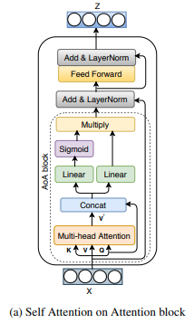

</img>

## Attention on Attention - Pytorch

A Pytorch implementation of the Attention on Attention module, from the paper <a href="https://arxiv.org/abs/2011.02164v1">An Improved Attention for Visual Question Answering</a>. The repository will include both the Self and Guided (cross-attention) variants.

## Install

```bash
$ pip install aoa-pytorch
```

## Usage

Self Attention on Attention

```python
import torch
from aoa_pytorch import AoA

attn = AoA(
    dim = 512,
    heads = 8
)

x = torch.randn(1, 1024, 512)
attn(x) + x # (1, 1024, 512)
```

Guided Attention on Attention

```python
```python
import torch
from aoa_pytorch import AoA

attn = AoA(
    dim = 512,
    heads = 8
)

x = torch.randn(1, 1024, 512)
context = torch.randn(1, 1024, 512)

attn(x, context = context) + x # (1, 1024, 512)
```

## Citations

```bibtex
@misc{rahman2020improved,
    title   = {An Improved Attention for Visual Question Answering}, 
    author  = {Tanzila Rahman and Shih-Han Chou and Leonid Sigal and Giuseppe Carenini},
    year    = {2020},
    eprint  = {2011.02164},
    archivePrefix = {arXiv},
    primaryClass = {cs.CV}
}
```

```bibtex
@misc{huang2019attention,
    title   = {Attention on Attention for Image Captioning}, 
    author  = {Lun Huang and Wenmin Wang and Jie Chen and Xiao-Yong Wei},
    year    = {2019},
    eprint  = {1908.06954},
    archivePrefix = {arXiv},
    primaryClass = {cs.CV}
}
```
